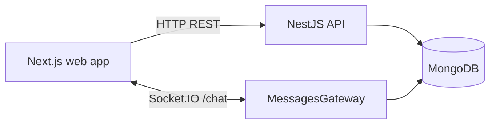

# Architecture Overview

Dworven Shaft is split into two independently run applications:

- `apps/web`: Next.js portal UI.
- `apps/api`: NestJS API with MongoDB persistence and Socket.IO realtime events.

The apps communicate through:

- HTTP REST endpoints for authentication, profiles, guild management, and message history.
- Socket.IO namespace `/chat` for realtime chat messages, presence, and typing events.

## Runtime Shape

## Main Responsibilities

Web:

- Renders the portal shell and feature pages.
- Owns local UI state with Zustand.
- Keeps the chat websocket connection alive across portal pages.
- Displays global, guild, whisper, and open-chat views.

API:

- Authenticates users with JWT access tokens and refresh tokens.
- Persists users, guilds, messages, and memberships in MongoDB.
- Enforces guild membership and message retention rules.
- Broadcasts realtime events through Socket.IO.

## Public Documentation

- API README: [apps/api/README.md](../../apps/api/README.md)
- Web README: [apps/web/README.md](../../apps/web/README.md)
- Swagger UI: `http://localhost:5000/docs` while the API is running.
