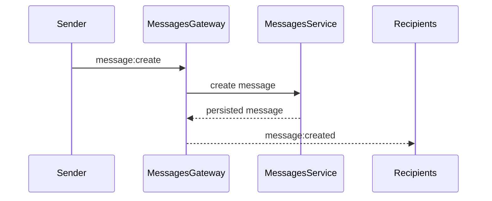

# Realtime Architecture

Realtime behavior uses Socket.IO namespace:

```text
/chat
```

## Authentication

The client sends the JWT access token through Socket.IO auth:

```ts
io(`${apiBaseUrl}/chat`, {
  auth: { token: accessToken },
  transports: ["websocket"],
});
```

The gateway also supports an `Authorization: Bearer <token>` fallback header.

## Rooms

The gateway joins each socket to:

- `user:<accountId>` for whisper and personal events.
- `guild:<guildId>` for guild channels.

Global events are broadcast at namespace level.

## Events

Client to server:

- `message:create`
- `typing:changed`

Server to client:

- `message:created`
- `presence:changed`
- `typing:changed`
- `chat:error`

## Message Flow



## Presence

The gateway tracks active socket IDs per account. It emits `presence:changed` only when:

- the first socket for an account connects,
- the last socket for an account disconnects.

This avoids duplicate online/offline events when the same user has multiple tabs open.

## Typing

Typing indicators are transient and never persisted.

- Web sends `typing:changed` with `isTyping: true` when the draft becomes active.
- Web sends `isTyping: false` after a short idle timeout, channel change, or message send.
- API validates and relays the event to the correct room.
- Web expires remote typing indicators automatically if no stop event arrives.
